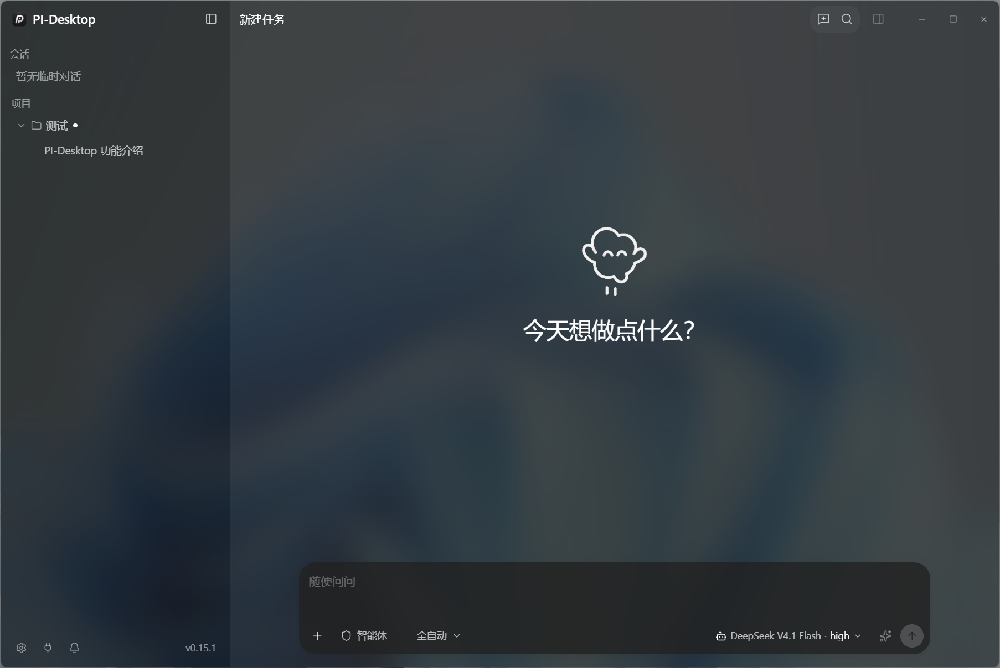
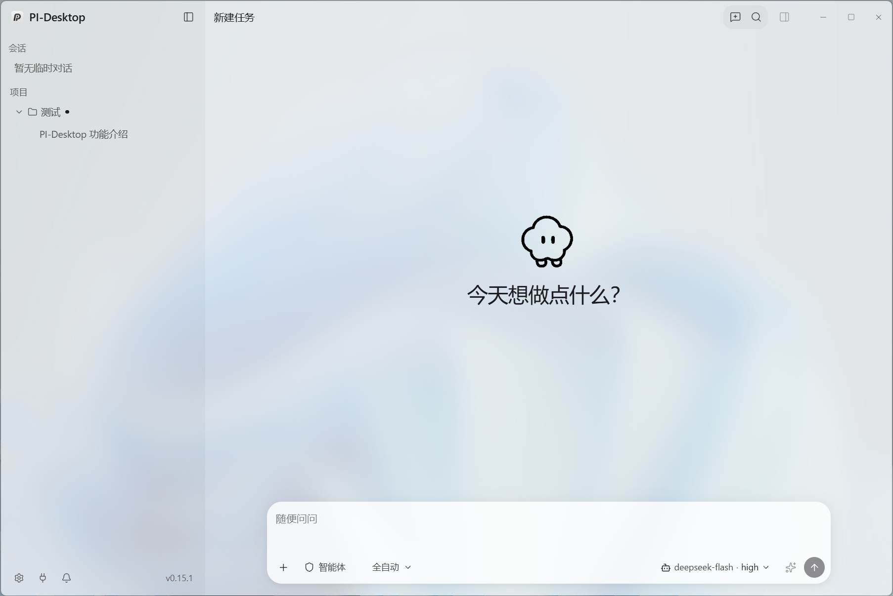

# Pi-Desktop-Next

**本地优先的 AI 编程 Agent 桌面客户端 · Windows 原生亚克力玻璃界面**

Local-first desktop client for AI coding agents — your models, your machine, a native
Windows acrylic glass shell.

> 当前发布线：**0.15.x**（Early Preview）。





## 为什么用它

- **本地优先** — 会话、项目与索引全部留在本机，不经过任何中转服务
- **自带模型** — 兼容 OpenAI / Anthropic / DeepSeek 等服务商，填入 Key 即用，也可指向自建 Endpoint
- **原生玻璃界面** — 窗口模糊由 Windows DWM 合成器直接提供，不是 CSS 模拟；深浅主题表现一致
- **完整的 Agent 能力** — 子智能体、技能、MCP、计划模式、内置浏览器预览、工作面板
- **可扩展** — Plugin SDK、主题系统与可贡献的 Settings 页面

## 技术栈

| 层 | 实现 |
| --- | --- |
| 桌面壳 | Electron 43 + electron-vite |
| 界面 | React 19 + Tailwind CSS 4 + Zustand |
| 宿主核心 | Rust（`crates/host-core`，rusqlite / tokio） |
| Agent 引擎 | `@earendil-works/pi-ai` + `pi-agent-core` |

## 快速开始

```bash
pnpm install
pnpm dev
```

打包 Windows 安装程序：

```bash
pnpm build                       # 编译 JS 包 + Rust host-core
cd apps/desktop
npx electron-vite build
npx electron-builder --win nsis
```

产物为 `apps/desktop/release/Pi-Desktop-Next-Setup-<version>.exe`。

> **环境要求**：Node ≥ 22.19、pnpm ≥ 10、Rust 工具链。
> 亚克力材质需要 Windows 11 22H2（build 22621）及以上；旧版 Windows 与 Linux 会自动回退为不透明窗口。

## 文档

- 详细中文说明 — [README.zh-CN.md](README.zh-CN.md)
- 完整文档站源码 — `docs/`
- 架构决策记录 — `docs/adr/`
- 领域规范 — `docs/spec/`

## 来源与许可

Pi-Desktop-Next 是上游项目 [vastsa/PI-Desktop](https://github.com/vastsa/PI-Desktop)
的下游衍生版本，遵循 **LGPL-3.0**（见 [LICENSE](LICENSE)）。上游的版权与许可声明
予以保留。

Modifications: 2026, SuKERY918 (Pi-Desktop-Next)

相对上游的主要改动：

1. Windows 端接入原生 DWM 亚克力材质（`backgroundMaterial: "acrylic"`），并把渲染层表面统一为一套
   半透明「罩纱」体系，使深浅主题下的玻璃质感与层级一致
2. 修复设置页、工作面板的多层半透明叠加，以及窗口按钮带与标题栏之间的色彩断层
3. 补齐若干 `prefers-reduced-motion` 缺口，以及一处从未定义过、导致「保存中」毫无反馈的关键帧
